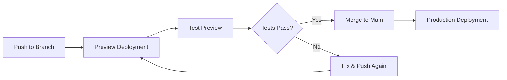

# 🔄 Vercel Preview Deployment Guide - Test Before Production

**Strategy:** Deploy to Preview → Test → Promote to Production  
**Last Updated:** January 18, 2026

---

## 🎯 **DEPLOYMENT STRATEGY**



---

## 📊 **VERCEL ENVIRONMENTS**

| Environment | Trigger | Purpose | URL |
|-------------|---------|---------|-----|
| **Production** | Push to `main` | Live app for users | `app-name.vercel.app` |
| **Preview** | Push to any other branch | Testing & validation | `app-name-git-branch.vercel.app` |
| **Development** | Local dev server | Local testing | `localhost:3000` |

---

## 🚀 **INITIAL SETUP - PREVIEW FIRST APPROACH**

### **Step 1: Create Preview Branch**

Instead of deploying directly to production, we'll create a preview branch first:

```bash
# Create preview branch from main
git checkout -b preview-deploy

# Push to GitHub (triggers preview deployment)
git push origin preview-deploy
```

### **Step 2: Import to Vercel (Preview Mode)**

For each app:

1. Go to https://vercel.com/new
2. Import `UseniSajor/kealee-platform-v10`
3. **IMPORTANT:** Configure for preview branch first

---

## 📦 **APP-BY-APP PREVIEW SETUP**

### **🔷 APP 1: os-admin (Preview Setup)**

#### **Vercel Configuration:**
```
Project Name: kealee-os-admin
Root Directory: apps/os-admin
Framework: Next.js
Build Command: (leave empty)
Install Command: (leave empty)

⚠️ Git Branch: preview-deploy
```

#### **Environment Variables (Preview):**
```bash
# === Preview Environment ===
NEXT_PUBLIC_API_URL=https://kealee-platform-v10-production.up.railway.app
NEXT_PUBLIC_SUPABASE_URL=your_supabase_url
NEXT_PUBLIC_SUPABASE_ANON_KEY=your_supabase_anon_key
NEXT_PUBLIC_APP_NAME=Kealee Admin Console [PREVIEW]

# Optional - distinguish preview from production
NEXT_PUBLIC_ENVIRONMENT=preview
```

#### **Preview URL:**
`https://kealee-os-admin-git-preview-deploy-yourusername.vercel.app`

---

### **🔷 APP 2: os-pm (Preview Setup)**

#### **Vercel Configuration:**
```
Project Name: kealee-os-pm
Root Directory: apps/os-pm
Framework: Next.js
Build Command: (leave empty)
Install Command: (leave empty)

⚠️ Git Branch: preview-deploy
```

#### **Environment Variables (Preview):**
```bash
NEXT_PUBLIC_API_URL=https://kealee-platform-v10-production.up.railway.app
NEXT_PUBLIC_SUPABASE_URL=your_supabase_url
NEXT_PUBLIC_SUPABASE_ANON_KEY=your_supabase_anon_key
NEXT_PUBLIC_APP_NAME=Kealee PM [PREVIEW]
NEXT_PUBLIC_ENVIRONMENT=preview
```

---

### **🔷 APP 3: m-architect (Preview Setup)**

#### **Vercel Configuration:**
```
Project Name: kealee-m-architect
Root Directory: apps/m-architect
Framework: Next.js
Build Command: (leave empty)
Install Command: (leave empty)

⚠️ Git Branch: preview-deploy
```

#### **Environment Variables (Preview):**
```bash
NEXT_PUBLIC_API_URL=https://kealee-platform-v10-production.up.railway.app
NEXT_PUBLIC_SUPABASE_URL=your_supabase_url
NEXT_PUBLIC_SUPABASE_ANON_KEY=your_supabase_anon_key
NEXT_PUBLIC_APP_NAME=Kealee Architect [PREVIEW]
NEXT_PUBLIC_ENVIRONMENT=preview
```

---

### **🔷 APP 4: m-ops-services (Preview Setup)**

#### **Vercel Configuration:**
```
Project Name: kealee-m-ops-services
Root Directory: apps/m-ops-services
Framework: Next.js
Build Command: (leave empty)
Install Command: (leave empty)

⚠️ Git Branch: preview-deploy
```

#### **Environment Variables (Preview):**
```bash
NEXT_PUBLIC_API_URL=https://kealee-platform-v10-production.up.railway.app
NEXT_PUBLIC_SUPABASE_URL=your_supabase_url
NEXT_PUBLIC_SUPABASE_ANON_KEY=your_supabase_anon_key

# Stripe (use TEST keys for preview!)
STRIPE_SECRET_KEY=sk_test_your_test_key
NEXT_PUBLIC_APP_URL=https://kealee-m-ops-services-git-preview-deploy-yourusername.vercel.app

# Stripe Test Price IDs
STRIPE_PRICE_PACKAGE_A=price_test_xxx
STRIPE_PRICE_PACKAGE_B=price_test_xxx
STRIPE_PRICE_PACKAGE_C=price_test_xxx
STRIPE_PRICE_PACKAGE_D=price_test_xxx

NEXT_PUBLIC_APP_NAME=Kealee PM Services [PREVIEW]
NEXT_PUBLIC_ENVIRONMENT=preview
```

---

## 🧪 **TESTING PREVIEW DEPLOYMENTS**

### **Automated Testing Checklist:**

Create `PREVIEW_TEST_CHECKLIST.md`:

```markdown
# Preview Deployment Test Checklist

## App: ________________

### ✅ Basic Functionality
- [ ] App loads without errors
- [ ] No console errors in browser
- [ ] All pages accessible
- [ ] Navigation works

### ✅ API Integration
- [ ] API calls return data
- [ ] Authentication works
- [ ] Data displays correctly
- [ ] Forms submit successfully

### ✅ Performance
- [ ] Page load < 3 seconds
- [ ] No memory leaks
- [ ] Images load properly
- [ ] Responsive on mobile

### ✅ Security
- [ ] Environment variables hidden
- [ ] No sensitive data exposed
- [ ] HTTPS enabled
- [ ] CORS working

### ✅ App-Specific (os-admin)
- [ ] Admin dashboard loads
- [ ] User management works
- [ ] Settings save correctly

### ✅ App-Specific (os-pm)
- [ ] Project list loads
- [ ] Project creation works
- [ ] Timeline displays

### ✅ App-Specific (m-architect)
- [ ] Design projects load
- [ ] File upload works
- [ ] Collaboration features work

### ✅ App-Specific (m-ops-services)
- [ ] Pricing page displays
- [ ] Stripe checkout loads (TEST MODE)
- [ ] Service requests work

---

**Tester:** _____________  
**Date:** _____________  
**Preview URL:** _____________  
**Status:** ✅ PASS / ❌ FAIL
```

---

## 🔄 **PREVIEW DEPLOYMENT WORKFLOW**

### **Complete Workflow:**

```bash
# 1. Create feature/fix branch
git checkout -b feature/new-feature

# 2. Make changes
# ... edit files ...

# 3. Commit and push
git add .
git commit -m "feat: add new feature"
git push origin feature/new-feature

# 4. Vercel automatically creates preview deployment
# Check Vercel dashboard for preview URL

# 5. Test preview deployment
# Use PREVIEW_TEST_CHECKLIST.md

# 6. If tests pass, merge to preview-deploy
git checkout preview-deploy
git merge feature/new-feature
git push origin preview-deploy

# 7. Test preview-deploy deployment thoroughly

# 8. If all tests pass, merge to main (production)
git checkout main
git merge preview-deploy
git push origin main

# 9. Monitor production deployment
# Check Vercel dashboard and logs
```

---

## 🎯 **ENVIRONMENT VARIABLE CONFIGURATION**

### **Set Variables for Each Environment:**

1. Go to Vercel Dashboard → Your Project
2. Click **Settings** → **Environment Variables**
3. For each variable, select environments:

| Variable | Preview | Production | Development |
|----------|---------|------------|-------------|
| `NEXT_PUBLIC_API_URL` | ✅ Same | ✅ Same | ✅ localhost |
| `NEXT_PUBLIC_SUPABASE_URL` | ✅ Same | ✅ Same | ✅ Same |
| `NEXT_PUBLIC_SUPABASE_ANON_KEY` | ✅ Same | ✅ Same | ✅ Same |
| `STRIPE_SECRET_KEY` | ✅ **TEST** | ✅ **LIVE** | ✅ **TEST** |
| `NEXT_PUBLIC_APP_NAME` | ✅ + [PREVIEW] | ✅ Normal | ✅ + [DEV] |
| `NEXT_PUBLIC_ENVIRONMENT` | ✅ preview | ✅ production | ✅ development |

**⚠️ CRITICAL:** Always use Stripe TEST keys in Preview environment!

---

## 🔍 **TESTING PREVIEW DEPLOYMENTS**

### **Test Each Preview Deployment:**

```bash
# 1. Get preview URL from Vercel dashboard
# Format: https://app-name-git-branch-username.vercel.app

# 2. Open in browser
open https://kealee-os-admin-git-preview-deploy-yourusername.vercel.app

# 3. Run through test checklist
# - Open DevTools Console (F12)
# - Check for errors
# - Test all features
# - Verify API connections
# - Test authentication

# 4. Test on multiple devices
# - Desktop Chrome
# - Desktop Safari
# - Mobile iOS Safari
# - Mobile Android Chrome

# 5. Performance testing
# - Lighthouse score (aim for 90+)
# - Page load times
# - Network requests
```

---

## ✅ **PROMOTION TO PRODUCTION**

### **When to Promote:**

✅ All preview tests pass  
✅ No console errors  
✅ Performance metrics good  
✅ Security checks complete  
✅ Stakeholder approval  

### **How to Promote:**

**Option 1: Merge via GitHub (Recommended)**
```bash
# Create Pull Request
gh pr create --base main --head preview-deploy --title "Release: Preview to Production"

# Review changes
gh pr view --web

# Merge when ready
gh pr merge --squash
```

**Option 2: Direct Merge**
```bash
git checkout main
git merge preview-deploy
git push origin main

# Vercel automatically deploys to production
```

---

## 🚨 **ROLLBACK PROCEDURE**

### **If Production Deploy Fails:**

```bash
# 1. Check Vercel logs
# Go to Deployment → View Function Logs

# 2. Quick rollback to previous deployment
# In Vercel Dashboard:
# - Go to Deployments
# - Find last working deployment
# - Click "..." → "Promote to Production"

# 3. Or rollback code
git revert HEAD
git push origin main

# 4. Fix issue in feature branch
git checkout -b hotfix/issue
# ... fix ...
git push origin hotfix/issue

# 5. Test in preview again
# 6. Merge when fixed
```

---

## 📋 **DEPLOYMENT CHECKLIST**

### **Before Each Deployment:**

#### **Preview Deployment:**
- [ ] Branch created from main
- [ ] Code changes committed
- [ ] Pushed to GitHub
- [ ] Preview URL received
- [ ] Test checklist completed
- [ ] No errors in logs
- [ ] Performance acceptable

#### **Production Deployment:**
- [ ] Preview fully tested
- [ ] Stakeholder approval received
- [ ] Production env vars verified
- [ ] Backup/rollback plan ready
- [ ] Monitoring enabled
- [ ] Team notified

#### **Post-Deployment:**
- [ ] Production URL accessible
- [ ] Smoke tests passed
- [ ] Analytics tracking
- [ ] Error monitoring active
- [ ] Documentation updated

---

## 🎛️ **VERCEL DASHBOARD SETUP**

### **Configure Each Project:**

1. **Git Integration:**
   - Settings → Git → Production Branch: `main`
   - Ignored Build Step: None
   - Auto Deploy: Enabled

2. **Environment Variables:**
   - Add variables for Preview, Production, Development
   - Use Stripe TEST keys for Preview
   - Use Stripe LIVE keys for Production only

3. **Deployment Protection:**
   - Settings → Deployment Protection
   - Enable for Production (Pro plan only)
   - Require password or vercel authentication

4. **Custom Domains (After Testing):**
   - Settings → Domains
   - Add custom domains to production only
   - Keep preview on Vercel subdomain

---

## 💡 **PRO TIPS**

### **Preview Deployment Best Practices:**

1. **Branch Naming:**
   ```bash
   feature/feature-name    # New features
   fix/bug-description     # Bug fixes
   hotfix/urgent-fix       # Urgent production fixes
   preview-deploy          # Main preview branch
   ```

2. **Commit Messages:**
   ```bash
   feat: add new feature
   fix: resolve bug
   docs: update documentation
   test: add tests
   chore: update dependencies
   ```

3. **Testing Strategy:**
   - Preview: All new features
   - Production: Only tested & approved code
   - Never deploy directly to production

4. **Environment Indicators:**
   ```typescript
   // Add to layout.tsx
   {process.env.NEXT_PUBLIC_ENVIRONMENT === 'preview' && (
     <div className="bg-yellow-500 text-black px-4 py-2 text-center">
       ⚠️ PREVIEW ENVIRONMENT - NOT PRODUCTION
     </div>
   )}
   ```

5. **Monitoring:**
   - Use Vercel Analytics
   - Set up error tracking (Sentry)
   - Monitor API response times
   - Track user behavior

---

## 📊 **DEPLOYMENT METRICS**

### **Track These Metrics:**

| Metric | Target | Tool |
|--------|--------|------|
| Build Time | < 3 min | Vercel Dashboard |
| Page Load | < 2 sec | Lighthouse |
| Time to Interactive | < 3 sec | Lighthouse |
| Error Rate | < 1% | Vercel Analytics |
| API Response Time | < 500ms | Railway Metrics |

---

## 🔐 **SECURITY BEST PRACTICES**

### **Environment Variables:**

✅ **DO:**
- Use different Stripe keys per environment
- Rotate keys regularly
- Use Vercel's encrypted storage
- Limit access to production keys

❌ **DON'T:**
- Commit `.env` files
- Share keys in Slack/email
- Use production keys in preview
- Hardcode sensitive values

### **Access Control:**

1. **Team Access:**
   - Vercel Settings → Team
   - Limit production access
   - Use role-based permissions

2. **Deployment Protection:**
   - Require authentication for previews
   - Use deployment protection for production
   - Enable IP allowlist if needed

---

## 🎉 **READY TO DEPLOY**

### **Quick Start (Preview First):**

```bash
# 1. Create preview branch
git checkout -b preview-deploy
git push origin preview-deploy

# 2. Import all 4 apps to Vercel
# Use preview-deploy branch
# Add environment variables

# 3. Test each preview deployment
# Use PREVIEW_TEST_CHECKLIST.md

# 4. If all pass, configure production
# Settings → Git → Production Branch: main

# 5. Merge to main when ready
git checkout main
git merge preview-deploy
git push origin main

# 6. Monitor production deployments! 🚀
```

---

## 📚 **ADDITIONAL RESOURCES**

- **Vercel Preview Docs:** https://vercel.com/docs/concepts/deployments/preview-deployments
- **Environment Variables:** https://vercel.com/docs/concepts/projects/environment-variables
- **Deployment Protection:** https://vercel.com/docs/security/deployment-protection
- **Custom Domains:** https://vercel.com/docs/concepts/projects/custom-domains

---

**Deploy smart, deploy safe! Always preview before production! 🛡️**
