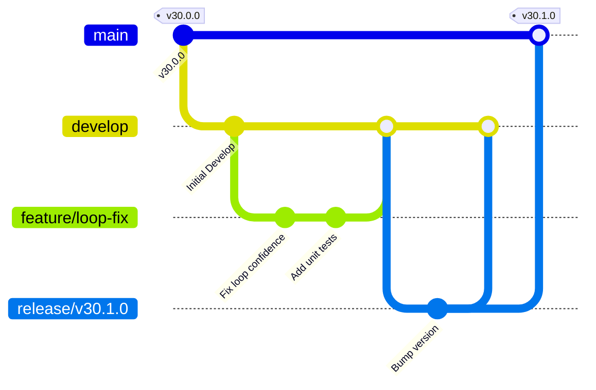

# Branching Strategy for Kealee Platform

To maintain a clean and reliable codebase, the Kealee Platform enforces a Git-flow based branching strategy. All developers and AI agents must adhere to these policies.

---

## 1. Branch Hierarchy



### `main`
- **Purpose:** Production-ready code only.
- **Rules:** 
  - Strictly matches production deployment status.
  - Direct pushes or force pushes are blocked.
  - Changes enter only via `release/*` or `hotfix/*` branches.

### `develop`
- **Purpose:** Central integration branch for ongoing development.
- **Rules:**
  - Standard branch to target for all feature PRs.
  - Must compile and pass tests at all times.
  - Direct pushes are blocked; changes enter via `feature/*` pull requests.

### `feature/*`
- **Purpose:** New features, tasks, refactorings, or database schema additions.
- **Naming Convention:** `feature/<issue-id>-<short-description>` (e.g. `feature/123-loop-orchestration`).
- **Rules:**
  - Branch off of: `develop`.
  - Target PR to merge back into: `develop`.
  - **AI Agent Rule:** All AI work must take place on `feature/*` branches.

### `release/*`
- **Purpose:** Preparing code for a new production release.
- **Naming Convention:** `release/v30.<minor>.<patch>` (e.g. `release/v30.1.0`).
- **Rules:**
  - Branch off of: `develop`.
  - Used for bug fixing, translation, documentation, and version bumping.
  - Target PR to merge back into: both `main` and `develop`.

### `hotfix/*`
- **Purpose:** Urgent fixes for critical bugs found in production.
- **Naming Convention:** `hotfix/<short-description>` (e.g. `hotfix/fix-checkout-payment`).
- **Rules:**
  - Branch off of: `main`.
  - Target PR to merge back into: both `main` and `develop`.

---

## 2. Commit and PR Workflow

1. **Checkout:** Update your local branch and check out a clean working branch:
   ```bash
   git checkout develop
   git pull origin develop
   git checkout -b feature/my-feature-description
   ```
2. **Commit Messages:** Commit messages should be descriptive and follow conventional commits:
   - `feat: add loop routing for contractor bids`
   - `fix: correct typo in DecisionPanel.tsx`
   - `test: add unit test for loop-router.ts`
   - `docs: update deployment guidelines`
3. **Keep Rebased:** Before opening a PR or merging, pull down the latest `develop` branch and rebase your branch to ensure a clean history:
   ```bash
   git fetch origin
   git rebase origin/develop
   ```
4. **Submit PR:** Push your branch to GitHub and open a pull request targeting `develop`. Fill out the Pull Request Template completely.
