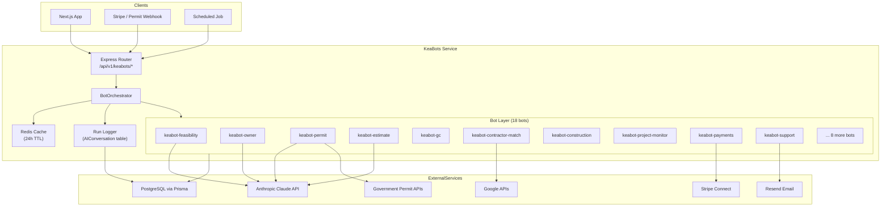
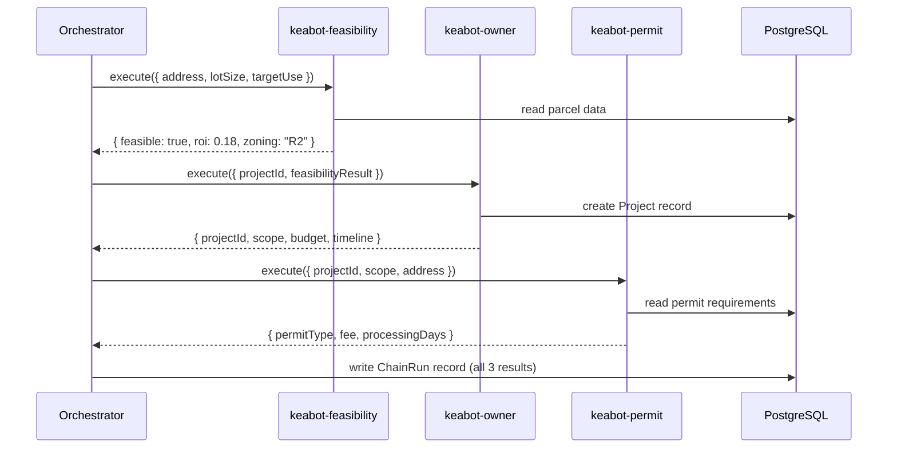

# KeaBots Architecture

This document describes the system design of the KeaBots service, including the full bot lifecycle, data flow, caching strategy, error handling, and scalability considerations.

---

## System Diagram

The diagram below shows the complete path from an inbound API request through the orchestrator, into the bot layer, and back.



---

## Bot Execution Lifecycle

Every call to `BotOrchestrator.execute()` follows this sequence:

```
Request received
      │
      ▼
1. Validate request schema (projectId, stage, data)
      │
      ▼
2. Build cache key
   key = sha256(`${stage}:${projectId}:${stableStringify(data)}`)
      │
      ▼
3. Cache lookup (Redis GET)
   ├── HIT  → return cached result immediately (latencyMs ~5ms)
   └── MISS → continue
      │
      ▼
4. Load bot class for stage
   (lazy-loaded, singleton per process lifetime)
      │
      ▼
5. bot.initialize()
   (connects to DB, sets up tool handlers)
      │
      ▼
6. bot.handleMessage(JSON.stringify(data))
   (calls Claude with system prompt + tools, runs tool loop)
      │
      ▼
7. Parse bot response JSON
      │
      ▼
8. Cache result (Redis SETEX, TTL = 86400s)
      │
      ▼
9. Log execution to AIConversation table
   (projectId, stage, latencyMs, tokenCount, success)
      │
      ▼
10. Return BotResult to caller
```

---

## Data Flow Between Chained Bots

When a project moves through multiple lifecycle stages, bots are chained using `BotOrchestrator.chainBots()`. The output of each bot is merged into the shared project context and passed as input to the next.



Each stage result is persisted before the next stage starts, so a failure mid-chain can be resumed from the last successful checkpoint.

---

## Caching Strategy

### Cache Key Format

```
keabot:cache:{stage}:{sha256(projectId + stableJSON(data))}
```

Example:
```
keabot:cache:permit:a3f8c2d1e9b47056...
```

### TTL Policy

| Scenario | TTL |
|----------|-----|
| Normal bot result | 24 hours (86400s) |
| Error result | Not cached (always retry) |
| Health check | 30 seconds |
| Contractor search | 6 hours (results change infrequently) |

### Cache Invalidation

Cache entries are invalidated explicitly when:
- A project record is updated in the database
- A bot is re-executed with `force: true` in the request
- An admin calls `DELETE /api/v1/keabots/cache/:projectId`

### Graceful Degradation

If Redis is unavailable (connection refused, timeout), the orchestrator logs a warning and falls through to the bot execution without caching. No requests fail due to Redis being down.

---

## Error Handling

### Timeout

Each bot execution has a 30-second timeout enforced by a `Promise.race` against a rejection timer. If the bot does not respond within 30 seconds:

```json
{
  "success": false,
  "stage": "permit",
  "error": "Bot execution timed out after 30000ms",
  "latencyMs": 30001
}
```

### Retry Policy

The orchestrator does not retry automatically on timeout — the caller is responsible for retrying with exponential backoff. This prevents cascading load on the Claude API.

For infrastructure-level retries (Railway restarts), the `railway.json` `restartPolicyMaxRetries` is set to 5 with `ON_FAILURE` policy.

### Fallback Responses

When a bot fails or times out, the orchestrator returns a structured error result rather than throwing. The calling application can choose to:
- Show a degraded UI with the last successful cached result
- Queue the stage for retry via the `JobQueue` model
- Alert via Resend email to the project owner

### Error Classification

| Error Type | HTTP Status | Behavior |
|------------|-------------|----------|
| Invalid request schema | 400 | Return validation errors immediately |
| Unknown stage | 400 | Return list of valid stages |
| Bot timeout | 504 | Return timeout error, do not cache |
| Claude API error | 502 | Return upstream error, do not cache |
| Database error | 500 | Return error, log to monitoring |
| Auth failure | 401 | Return 401, do not invoke bot |

---

## Scalability Notes

### Horizontal Scaling

The `BotOrchestrator` is stateless between requests. All state lives in PostgreSQL (via Prisma) and Redis. This means multiple instances of the keabots service can run behind a load balancer without coordination.

### Bot Loading

Bots are lazy-loaded and cached as singletons within a process. A cold start loads zero bots; each bot class is instantiated on first use and reused for subsequent requests. This keeps memory overhead low for bots that are rarely used.

### Claude API Concurrency

Each bot call to Claude is independent. Under high load, requests fan out in parallel. Rate limiting is handled by the Anthropic SDK's built-in retry logic. For sustained high throughput, implement a token-bucket rate limiter in front of `bot.handleMessage()`.

### Database Connection Pooling

Prisma uses a connection pool (default size: 10). For Railway deployments with multiple replicas, set `DATABASE_CONNECTION_LIMIT` to avoid exhausting PostgreSQL connections:

```
DATABASE_URL=postgresql://...?connection_limit=5
```

### Job Queue Integration

Long-running bot chains (e.g., full project setup across 5 stages) should be queued via the `JobQueue` model and processed by a BullMQ worker rather than executed synchronously in an HTTP request. The `keabot-command` bot handles job queue management.
