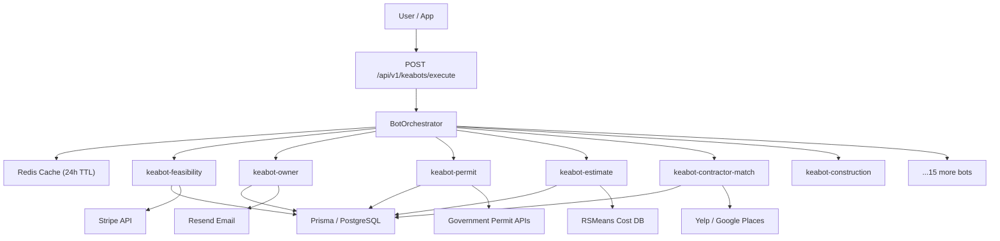

# KeaBots — AI Automation Agents for Construction Projects

KeaBots is a suite of 18 AI-powered automation agents built on the Kealee Platform. Each bot owns a specific stage of the construction project lifecycle, from initial feasibility analysis through post-construction support. Together they form an end-to-end automation layer that reduces manual overhead, accelerates decision-making, and surfaces actionable insights at every step of a build.

All bots are built on the shared `@kealee/core-bots` package, use the Anthropic Claude API for intelligence, and are orchestrated by a central `BotOrchestrator` service.

---

## Quick Start

### Build all bots

```bash
# From the repo root
pnpm install
bash scripts/build-keabots.sh
```

### Run the orchestrator locally

```bash
cd services/keabots
pnpm run dev
```

The service starts on port 3100 by default. Set `PORT` in your environment to override.

### Run tests

```bash
# All bot tests
pnpm --filter @kealee/bots test

# Single bot
pnpm --filter @kealee/bots test -- --testPathPattern keabot-marketing
```

### Deploy to Railway

```bash
# Requires Railway CLI and environment variables (see Deployment section)
bash scripts/deploy-keabots.sh
```

---

## Architecture



---

## All 18 KeaBots

| # | Bot Name | Purpose | Lifecycle Stage |
|---|----------|---------|----------------|
| 1 | **keabot-feasibility** | Analyzes site viability, zoning, ROI projections | Pre-Development |
| 2 | **keabot-developer** | Manages developer onboarding and project creation | Pre-Development |
| 3 | **keabot-land** | Land acquisition analysis, title research, parcel data | Pre-Development |
| 4 | **keabot-finance** | Financial modeling, loan structuring, investor reporting | Pre-Development |
| 5 | **keabot-owner** | Project owner intake, requirements gathering, scope definition | Planning |
| 6 | **keabot-permit** | Permit research, application generation, status tracking | Planning |
| 7 | **keabot-design** | Design brief coordination, architect RFP, review cycles | Planning |
| 8 | **keabot-estimate** | Cost estimation using RSMeans, assemblies, and takeoff data | Planning |
| 9 | **keabot-gc** | General contractor selection, bid solicitation, contract review | Pre-Construction |
| 10 | **keabot-contractor-match** | Trade contractor matching, scoring, license verification | Pre-Construction |
| 11 | **keabot-marketplace** | Marketplace listing management, buyer/seller coordination | Pre-Construction |
| 12 | **keabot-construction** | Active construction monitoring, daily log processing, RFI tracking | Construction |
| 13 | **keabot-project-monitor** | Real-time progress tracking, issue detection, milestone management | Construction |
| 14 | **keabot-payments** | Milestone-based payment disbursement, draw requests, lien waivers | Construction |
| 15 | **keabot-operations** | Facilities handover, O&M documentation, warranty tracking | Post-Construction |
| 16 | **keabot-command** | Command center dashboard, system health, cross-bot orchestration | Platform-Wide |
| 17 | **keabot-marketing** | SEO setup, lead scoring, email sequences, social content | Platform-Wide |
| 18 | **keabot-support** | Ticket routing, FAQ answering, refund processing, escalation | Platform-Wide |

---

## Integration Points

### Anthropic Claude API
All bots use `@anthropic-ai/sdk` for natural language understanding and reasoning. Each bot has a dedicated system prompt tuned for its domain. Set `ANTHROPIC_API_KEY` in your environment.

### Prisma / PostgreSQL
All structured data (projects, bots runs, contractor records, milestones) is persisted through the shared `@kealee/database` package using Prisma. Set `KEALEE_DATABASE_URL` to a PostgreSQL connection string.

### Stripe
`keabot-payments` and `keabot-finance` integrate with Stripe Connect for milestone disbursements, draw request processing, and platform fee management. Set `STRIPE_API_KEY` and `STRIPE_WEBHOOK_SECRET`.

### Resend
`keabot-marketing` and `keabot-support` send transactional and sequence emails via the Resend API. Set `RESEND_API_KEY` and `RESEND_FROM_EMAIL`.

### Google APIs
`keabot-marketing` uses Google Search Console and Google Analytics for SEO setup. `keabot-permit` queries relevant government data APIs for permit status. Set `GOOGLE_API_KEY` and `GOOGLE_OAUTH_CLIENT_ID` as needed.

### Redis (optional)
Bot results are cached in Redis with a 24-hour TTL to avoid redundant Claude API calls. Set `REDIS_URL`. If Redis is unavailable the service degrades gracefully to no-cache mode.

---

## API Endpoint Examples

### Execute a bot stage

```bash
curl -X POST https://keabots.kealee.com/api/v1/keabots/execute \
  -H "Content-Type: application/json" \
  -H "Authorization: Bearer $KEALEE_API_KEY" \
  -d '{
    "projectId": "proj_abc123",
    "stage": "permit",
    "data": {
      "address": "123 Main St, Austin TX 78701",
      "projectType": "residential_addition",
      "squareFeet": 400
    }
  }'
```

Response:

```json
{
  "success": true,
  "stage": "permit",
  "projectId": "proj_abc123",
  "result": {
    "permitRequired": true,
    "estimatedFee": 850,
    "processingDays": 21,
    "applicationUrl": "https://permits.austintexas.gov/..."
  },
  "latencyMs": 1240,
  "cached": false
}
```

### Health check

```bash
curl https://keabots.kealee.com/api/v1/keabots/health
```

Response:

```json
{
  "status": "healthy",
  "bots": { "total": 18, "healthy": 18, "degraded": 0 },
  "database": "connected",
  "checkedAt": "2026-04-07T14:30:00.000Z"
}
```

---

## Environment Variables

| Variable | Required | Description |
|----------|----------|-------------|
| `ANTHROPIC_API_KEY` | Yes | Claude API key |
| `KEALEE_DATABASE_URL` | Yes | PostgreSQL connection string |
| `STRIPE_API_KEY` | Yes | Stripe secret key |
| `RESEND_API_KEY` | Yes | Resend email API key |
| `REDIS_URL` | No | Redis URL for result caching |
| `GOOGLE_API_KEY` | No | Google APIs (SEO, Places) |
| `PORT` | No | HTTP port (default: 3100) |
| `LOG_LEVEL` | No | Log level: debug/info/warn/error |

---

## Deployment

KeaBots deploys to Railway using the `services/keabots/railway.json` configuration. The service is built with Nixpacks and started with `node dist/orchestrator.js`.

For CI/CD, push to the `main` branch to trigger an automatic Railway deployment. For manual deployments, run `bash scripts/deploy-keabots.sh` with the Railway CLI installed and authenticated.

See [ARCHITECTURE.md](./ARCHITECTURE.md) for system design details and [API_REFERENCE.md](./API_REFERENCE.md) for full endpoint documentation.
